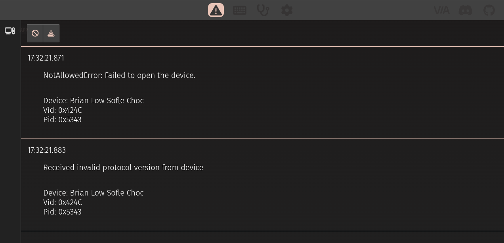

.
.
.
.
.
.
.
.
.
.
.
.
.
.
.
.
.

## When using VIA with linux:

If u encounter error trying to use **VIA** "FILE_ERROR_ACCESS_DENIED" or something similar when connecting a keyboard/device:



1. Open VIA in Chrome using **Incognito mode**.


2. Connect your keyboard. You will see an error — that's expected.


3. In a new Chrome tab, go to: chrome://device-log

4. Search the log for an entry like:
    *|HID| |Event|  Failed to open '/dev/hidraw<NUMBER>': FILE_ERROR_ACCESS_DENIED*


5. Open a terminal and enter: 
    ``` bash 
        sudo chmod a+rw /dev/hidraw<NUMBER>
        sudo chmod 766 /dev/hidraw<NUMBER> # or
    ```
6. Permissions can be manually removed or after reboot they will be as they were before (probably, idk)  
    ``` bash 
        sudo chmod 600 /dev/hidraw<NUMBER> 
    ```